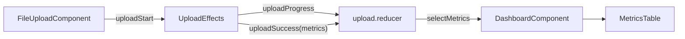

# Архитектура проекта «Аналитика соцсетей»

_Dокумент создан автоматически. Описаны назначение и взаимодействие всех ключевых файлов._

## Содержание

1. [Общая структура](#общая-структура)
2. [Core](#core)
3. [Shared](#shared)
4. [Features](#features)
   1. [Auth](#auth)
   2. [Upload](#upload)
   3. [Dashboard](#dashboard)
   4. [Reports](#reports)
5. [Store](#store)
6. [Интернационализация](#интернационализация)

---

## Общая структура

```
src/
  app/
    core/        # Базовые сервисы, i18n, перехватчики HTTP
    shared/      # Переиспользуемые компоненты, пайпы, модели
    features/    # Фич-модули (auth, upload, dashboard, reports)
  assets/        # Статические файлы, sample.csv и т. д.
  environments/  # prod / dev конфигурации
```

Каждый *feature-module* lazy-загружается через Angular Router. NgRx используется точечно: `upload` — как срез store для загрузки и расчёта метрик.

---

## Core

| Файл | Назначение |
|------|------------|
| **core.module.ts** | Рееструет `HTTP_INTERCEPTORS`, инициализирует сервисы Core-слоя. |
| **interceptors/auth.interceptor.ts** | Перехватывает все исходящие HTTP-запросы, подставляет `Authorization: Bearer <JWT>` при наличии токена. |
| **auth/auth.service.ts** | Базовый сервис аутентификации. В режиме `mockAuth=true` работает с локальным массивом пользователей, иначе бьётся в API `/auth`. Методы: `login`, `register`, `logout`, `getToken`. |
| **auth/auth.guard.ts** | Route Guard: пускает только с валидным токеном; иначе редирект в `/auth/login`. |
| **services/notification.service.ts** | Универсальные toast-уведомления (MatSnackBar). |
| **services/api.service.ts** | Обёртка над `HttpClient` с удобными методами `get/post/put/delete`. |
| **i18n/translation.module.ts** | Настройка `@ngx-translate/core` с `assets/i18n/*.json`. |

---

## Shared

| Файл | Назначение |
|------|------------|
| **shared.module.ts** | Экспортирует Material-модули, `HeaderComponent` и прочие общие компоненты. Используется всеми фичами. |
| **components/header/** | Шапка с навигацией и кнопкой *Logout*. |
| **models/metric.model.ts** | Тип `MetricRow` — основа для таблиц/графиков с метриками. |

---

## Features

### Auth

| Файл | Назначение |
|------|------------|
| **auth.module.ts** | Lazy-модуль `/auth`. Содержит роуты login/register. |
| **login/*.component.ts** | Форма логина, обращается к `AuthService.login`. |
| **register/*.component.ts** | Форма регистрации; кастомный валидатор совпадения паролей. |

### Upload

| Файл | Назначение |
|------|------------|
| **upload.module.ts** | Lazy-модуль `/upload`. Подключает NgRx‐feature `upload`. |
| **components/file-upload/** | Drag-and-drop загрузка *до трёх* CSV одновременно: валидация, progress bar, обязательный выбор платформы (YouTube/VK/TikTok). Диспатчит по одному `uploadStart` на каждый файл. |
| **store/upload.actions.ts** | NgRx actions: `uploadStart`, `uploadProgress`, `uploadSuccess`, `uploadFail`, `uploadAccepted`, `processingProgress`, `metricsLoaded`. |
| **store/upload.reducer.ts** | Хранит `metrics` объединённо; при повторных загрузках мерджит значения по ключу `metric` и префиксу платформы. |
| **store/upload.effects.ts** | • В dev-режиме читает каждый файл локально, поддерживает три структуры CSV YouTube (Geography, Traffic Sources, Timeline) + generic Date-Likes-Views-Subs. <br>• В prod POST-ит `FormData(file, period, platform)` на `/api/upload`. |

> **Новое**: `computeMetrics()` умеет определять тип YouTube-отчёта и возвращать соответствующие `MetricRow[]`. Платформа всегда задаётся пользователем, автоматическое определение убрано.

#### Объединение метрик
При получении новых данных `mergeMetrics()` в reducer:
1. Префиксирует название метрики `[YouTube] …`, `[VK] …`, `[TikTok] …`.
2. Если метрика присутствовала и оба значения числовые – суммирует; иначе замещает.

### Dashboard

| Файл | Назначение |
|------|------------|
| **dashboard.module.ts** | Lazy-модуль `/dashboard`. |
| **components/dashboard/** | Подписывается на `store.select(selectMetrics)`, передаёт данные вниз в таблицу/графики. |
| **components/metrics-table/** | Простая MatTable; если данных нет — показывает пустое состояние. |
| **components/charts/** | Заглушка под будущие графики (добавлять ApexCharts/Chart.js). |

### Reports

| Файл | Назначение |
|------|------------|
| **reports.module.ts** | Lazy-модуль `/reports`. |
| **components/report-preview/** | Показывает таблицы метрик по платформам, экспортирует **CSV** и **PDF**. PDF формируется через `pdfmake` (Unicode, Roboto), т.к. jsPDF не поддерживал кириллицу. |

---

## Store

NgRx используется минималистично: сейчас только feature-slice `upload`. Для остальных фич (auth, dashboard…) можно расширять store, но пока необходимости нет.

Диаграмма потоков:



---

## Интернационализация

• Базовый язык — `ru`. <br>• Для новых языков достаточно добавить `assets/i18n/en.json` и вызвать `translate.use('en')`.

---
