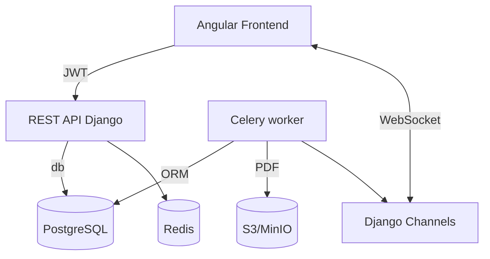

# Архитектура backend-сервиса «Аналитика соцсетей»

> Стек: **Django 4.2 / Django REST Framework 3.14 / PostgreSQL 15 / Celery 5 / Redis 7**  
> Дополнительно: Django Channels 4 (WebSocket), drf-spectacular (OpenAPI), structlog.

---
## Общая схема компонентов



---
## Структура репозитория

```
backend/
  manage.py
  config/
    __init__.py        # настройки Celery
    settings.py        # базовые настройки
    celery.py          # celery-app
    urls.py
    asgi.py            # ASGI для Channels
  apps/
    users/             # кастомная модель User + JWT
    files/             # загрузка CSV, хранение, статус
    rawdata/           # сохранение строк CSV
    metrics/           # расчёты и доступ к метрикам
    reports/           # генерация CSV/PDF
    notifications/     # WebSocket события
  requirements.txt
  docker-compose.yml   # django, postgres, redis, celery
```

---
## Приложения и модели

### users
| Model | Поля | Комментарий |
|-------|------|-------------|
| `User` | email (UID), password, date_joined… | Subclass `AbstractBaseUser`, JWT (Simple JWT).

### files
| Model | Поля | |
|-------|------|--|
| `SocialFile` | `id: UUID`, `user`, `original_name`, `path`, `period_days`, `status`, `error_text`, `created_at`, `finished_at`, `platform` varchar(10) | Enum `status`: uploading / processing / ready / error.

### rawdata
| Model | Поля |
|-------|------|
| `RawData` | `id`, `file`, `date`, `likes`, `views`, `subscribers`, _extra JSON_ | Index `(file, date)`.

### metrics
| Model | Поля |
|-------|------|
| `Metric` | `id`, `file`, `metric_code`, `value` (decimal / text), `calc_period` (daterange), `created_at` | `UNIQUE(file, metric_code, calc_period)`.

### reports
| Model | Поля |
|-------|------|
| `ReportExport` | `id: UUID`, `file`, `format`, `path`, `created_at` |

---
## Сервис-слой

### Цепочка загрузки файла
1. **POST /api/upload** – `UploadView` (`APIView`).
   * Принимает `multipart` (file, period, platform).
   * Создаёт `SocialFile(status='uploading')`, сохраняет файл.
   * Отправляет задачу `parse_csv.delay(file_id)` → Celery.  
   * Возвращает `202 Accepted {file_id}`.
2. **Celery task `parse_csv`**
   * Обновляет статус `processing`, `progress=0`.
   * Читает CSV chunk-ами (pandas / csv reader).
   * Валидация: колонки, дубликаты, размеры → при ошибке `status=error`.
   * Сохраняет `RawData` батчами `bulk_create`.
   * Вызывает `calc_metrics(file_id)`.
3. **Celery task `calc_metrics`**
   * Читает `RawData` → pandas DataFrame.
   * Считает метрики (posts, subs_growth, ER …).  
   * Пишет `Metric` объекты.
   * `SocialFile.status = ready`, `finished_at=now()`.
   * Через Channels отправляет event `{file_id, status:'ready'}`.

### Генерация отчётов
* `GET /reports/{file_id}?format=pdf|csv` → если отчёт уже есть → отдаёт ссылку.  
* Иначе Celery-task `generate_report` формирует файл (csv writer / ReportLab / WeasyPrint) → S3 → создает `ReportExport`.

---
## REST API (DRF-Spectacular схема)
| Method & URL | View | Auth | Описание |
|--------------|------|------|----------|
| `POST /auth/register` | `RegisterView` | — | Создание пользователя. |
| `POST /auth/login` | `TokenObtainPairView` | — | JWT (`access`, `refresh`). |
| `POST /auth/refresh` | `TokenRefreshView` | — | Обновить access. |
| `GET /auth/me` | `MeView` | JWT | Текущий пользователь. |
| `POST /upload` | `UploadView` | JWT | Приём CSV. Возврат 202 `{file_id}`. |
| `GET /upload/<uuid>/status` | `UploadStatusView` | JWT | `status`, `progress`, `error_text`. |
| `GET /metrics/<uuid>` | `MetricsView` | JWT | Массив метрик для файла. |
| `GET /metrics/latest` | `LatestMetricsView` | JWT | Метрики последнего загруженного файла. |
| `GET /reports/<uuid>` | `ReportDownloadView` | JWT | Скачивание / генерация отчёта. |
| `GET /reports/list` | `ReportListView` | JWT | История отчётов. |

WebSocket: `/ws/status/` – события JSON `{file_id, status|progress|error}`.

---
## Настройки (config/settings.py)
* `INSTALLED_APPS`: `rest_framework`, `rest_framework_simplejwt`, `django_celery_results`, `channels`, custom apps.  
* `REST_FRAMEWORK` – глобальный пагинатор, разрешения, авто-schema spectacular.
* DB: `PostgreSQL`, `UUIDField` по умолчанию.  
* Media → `/media` или S3 (django-storages).  
* Celery: `redis://redis:6379/0` broker, `django_celery_results` backend.  
* Auth: `AUTH_USER_MODEL = 'users.User'`.

---
## Docker / Deploy
```yaml
docker-compose.yml
  postgres:
  redis:
  django:
    command: gunicorn config.asgi:application -k uvicorn.workers.UvicornWorker
  celery_worker:
  celery_beat:
```
* Migrations при startup.  
* Статические файлы – Collectstatic.  
* Nginx / Traefik для SSL + websocket-proxy.

---
## Тестирование
* `pytest + pytest-django` – unit всех задач, API-endpoints.  
* FactoryBoy для фикстур.  
* CI GitHub Actions: lint → tests → build docker.

---
## Точки расширения
1. Поддержка других соцсетей – добавить парсеры и дополнительные колонки.  
2. OAuth 2.0 вместо CSV – прямое подключение к API площадок.  
3. Роли/права: admin – видеть все файлы, user – только свои.  
4. Кластеризация Celery (autoscale), Prometheus + Grafana.

---
_Документ покрывает high-level дизайн; детали реализации описываются в docstrings и swagger-schema._ 